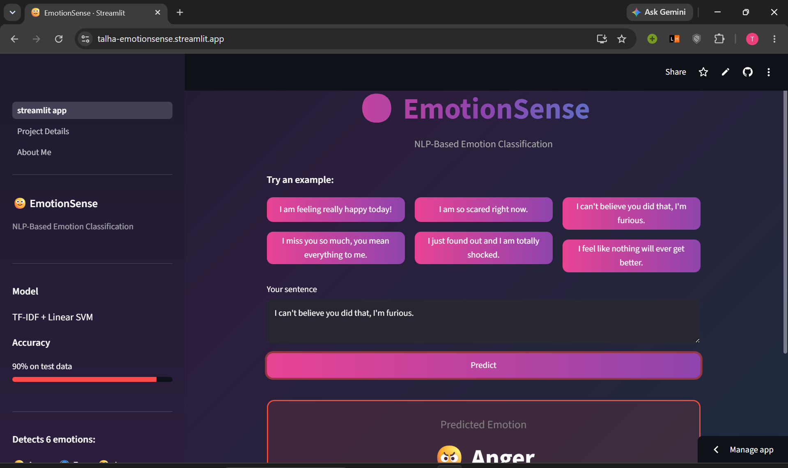
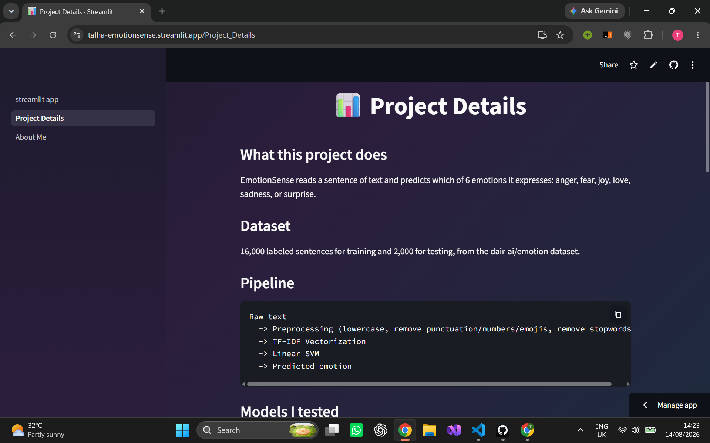
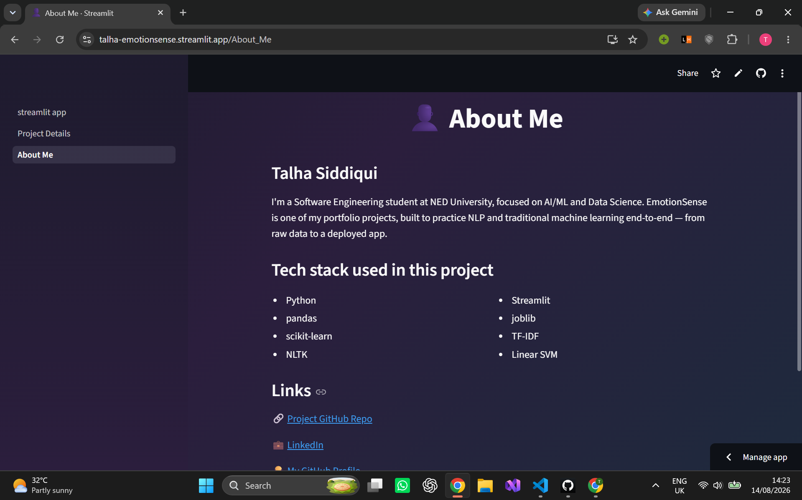

<div align="center">

# 🙂 EmotionSense

### NLP-Based Emotion Classification

*Turning raw text into understood emotion — built end-to-end with classic NLP and Machine Learning.*

[](https://www.python.org/)
[](https://scikit-learn.org/)
[](https://streamlit.io/)
[](#)

**[🚀 Live Demo](https://talha-emotionsense.streamlit.app/)** &nbsp;|&nbsp; **[📂 Repository](https://github.com/talha-siddiqui137/EmotionSense--NLP-Based-Emotion-Classification)**

</div>

<br>

<p align="center">
  
</p>

<p align="center">
  <em>Main prediction page — try an example or type your own sentence</em>
</p>

---

## Overview

EmotionSense is a machine learning application that reads a sentence of text and predicts the emotion behind it — **anger, fear, joy, love, sadness, or surprise**. It's built as a complete, professional ML project: from raw data, through experimentation and model selection, to a deployed interactive web app.

This project was built to demonstrate real, applied understanding of the traditional NLP + Machine Learning pipeline — not just calling a library, but knowing *why* each choice was made.

---

## Features

- 🎯 Classifies text into 6 emotions with ~90% accuracy
- ⚡ Instant predictions through a clean, interactive Streamlit interface
- 📊 Full transparency into the model comparison and tuning process behind the final model
- 🧪 Automated test suite covering preprocessing and prediction
- 🏗️ Clean, modular, production-style project structure

---

## Problem Statement

Understanding emotion in text is a foundational NLP task, useful in areas like customer feedback analysis, mental health monitoring tools, and social media sentiment tracking. The goal of this project was to build an accurate, interpretable, traditional-ML solution to this problem — and package it as a real, usable application.

---

## Dataset

- **Source:** [dair-ai/emotion](https://huggingface.co/datasets/dair-ai/emotion) dataset
- **Size:** 16,000 labeled training sentences, 2,000 test sentences
- **Format:** `text;emotion` per line
- **Classes:** `anger`, `fear`, `joy`, `love`, `sadness`, `surprise`

> The dataset is not included in this repository (see [Installation](#installation) for how to get it). This keeps the repository small and respects the dataset's own distribution terms.

---

## NLP Pipeline

```
Raw text
   ↓
Preprocessing
   ↓
TF-IDF Vectorization (unigrams + bigrams)
   ↓
Linear SVM
   ↓
Predicted Emotion
```

---

## Text Preprocessing

Each sentence is cleaned with a single reusable function (`src/preprocessing.py`) before it reaches the model:

1. Lowercasing
2. Punctuation removal
3. Number removal
4. Non-ASCII / emoji removal
5. Tokenization
6. Stopword removal

The same function is used during both training and prediction, guaranteeing there's never a mismatch between how the model was trained and how it sees real input.

---

## Feature Engineering

Text is converted into numeric features using **TF-IDF (Term Frequency – Inverse Document Frequency)**, with an n-gram range of `(1, 2)` — meaning both single words and two-word phrases are captured. This range was chosen after direct experimentation (see below).

---

## Models Evaluated

Three classic ML models were trained and compared, each with two different feature extraction techniques:

| Model | Bag of Words | TF-IDF |
|---|---|---|
| Multinomial Naive Bayes | 76.78% | 66.09% |
| Logistic Regression | 88.88% | 86.16% |
| **Linear SVM** | 88.97% | **89.19%** |

**Linear SVM with TF-IDF performed best** and was selected for further tuning.

---

## Experiment Results

**N-gram range comparison (SVM + TF-IDF):**

| N-gram range | Accuracy | Macro F1 |
|---|---|---|
| Unigram only | 89.19% | – |
| **Unigram + Bigram** | **90.13%** | **0.87** |
| Unigram + Bigram + Trigram | 89.91% | – |

Adding trigrams did not improve results further, so unigrams + bigrams was kept as the final configuration.

---

## Hyperparameter Tuning

The SVM's regularization strength (`C`) was tuned across five values:

| C | Accuracy | Macro F1 |
|---|---|---|
| 0.01 | 55.00% | 0.2523 |
| 0.1 | 85.69% | 0.7975 |
| 1 | 90.12% | 0.8672 |
| 10 | 90.16% | 0.8687 |
| **100** | **90.16%** | **0.8698** |

`max_iter` was increased to `5000` to resolve a convergence warning at higher `C` values.

---

## Final Model

```python
TfidfVectorizer(ngram_range=(1, 2))
LinearSVC(C=100, max_iter=5000)
```

---

## Evaluation Metrics

Evaluated on the held-out **2,000-sentence test set**:

**Accuracy: 90.2%**

| Class | Precision | Recall | F1-score |
|---|---|---|---|
| Anger | 0.91 | 0.88 | 0.89 |
| Fear | 0.88 | 0.85 | 0.86 |
| Joy | 0.93 | 0.93 | 0.93 |
| Love | 0.79 | 0.81 | 0.80 |
| Sadness | 0.93 | 0.95 | 0.94 |
| Surprise | 0.72 | 0.70 | 0.71 |

**Macro F1:** 0.86 &nbsp;|&nbsp; **Weighted F1:** 0.90

---

## Confusion Matrix

```
              anger  fear  joy  love  sadness  surprise
anger    [    242     7    6     1      19        0   ]
fear     [      7   190    2     0      15       10   ]
joy      [      2     2  645    32       7        7   ]
love     [      2     0   27   128       1        1   ]
sadness  [     13     5    9     1     553        0   ]
surprise [      0    12    6     0       2       46   ]
```

`surprise` is the weakest-performing class, largely due to having the fewest training examples of the six.

---

## Project Architecture

```
emotion-sense-nlp/
│
├── app/
│   ├── streamlit_app.py       # Main prediction page
│   └── pages/
│       ├── 1_Project_Details.py
│       └── 2_About_Me.py
│
├── src/
│   ├── config.py               # Central path configuration
│   ├── preprocessing.py        # Reusable text cleaning function
│   ├── data_loader.py          # Dataset loading + label mapping
│   ├── train.py                # Training pipeline
│   ├── evaluate.py             # Model evaluation
│   └── predict.py              # Inference for the app
│
├── tests/
│   ├── test_preprocessing.py
│   └── test_predict.py
│
├── models/                     # Saved model, vectorizer, label map
├── data/                       # train.txt / test.txt (not committed)
├── notebooks/                  # Original experimentation notebook
│
├── requirements.txt
├── .gitignore
└── README.md
```

---

## Installation

```bash
git clone https://github.com/talha-siddiqui137/EmotionSense--NLP-Based-Emotion-Classification.git
cd EmotionSense--NLP-Based-Emotion-Classification
pip install -r requirements.txt
```

Then download the dataset from [dair-ai/emotion](https://huggingface.co/datasets/dair-ai/emotion) and place `train.txt` and `test.txt` inside the `data/` folder.

---

## Running Locally

**Train the model:**
```bash
python -m src.train
```

**Evaluate the model:**
```bash
python -m src.evaluate
```

**Run the app:**
```bash
python -m streamlit run app/streamlit_app.py
```

---

## Streamlit Demo

🔗 **Live app:** [talha-emotionsense.streamlit.app](https://talha-emotionsense.streamlit.app/)

The app includes:
- An interactive prediction page with example sentences
- A Project Details page covering the full model comparison and tuning process
- An About Me page

<p align="center">
  
</p>
<p align="center"><em>Project Details page — pipeline, model comparison, and tuning results</em></p>

<p align="center">
  
</p>
<p align="center"><em>About Me page — background, tech stack, and links</em></p>

---

## Example Prediction

**Input:**
```
"I am feeling really happy today!"
```

**Output:**
```
Predicted Emotion: Joy 😄
```

---

## Technologies Used

- **Python**
- **pandas** — data loading and manipulation
- **scikit-learn** — TF-IDF, Linear SVM, evaluation metrics
- **NLTK** — tokenization and stopword removal
- **Streamlit** — web application interface
- **joblib** — model persistence

---

## Limitations

- Trained on relatively short, single-sentence inputs — longer or multi-topic text may be less reliable.
- `surprise` is under-represented in the training data, leading to weaker performance on that class.
- As a traditional ML model, it does not capture deep contextual meaning the way transformer-based models can.

---

## Future Improvements

This project uses traditional ML as a deliberate baseline. Planned future work includes comparing this baseline against deep learning approaches:

- Word embeddings (Word2Vec / GloVe)
- RNN / LSTM / GRU architectures
- Transformer-based models (e.g. BERT)

---

## Author

**Talha Siddiqui**
Software Engineering student, NED University — focused on AI/ML and Data Science

- GitHub: [github.com/talha-siddiqui137](https://github.com/talha-siddiqui137)
- LinkedIn: [linkedin.com/in/talha-siddiqui137](https://www.linkedin.com/in/talha-siddiqui137/)
- Email: talha03182301690@gmail.com
